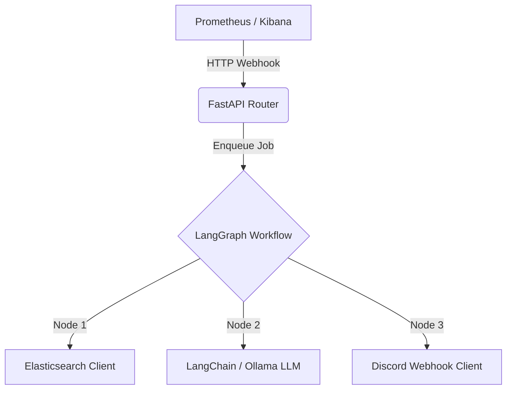

# TMCP AIOps Agent: System Overview

## 1. Introduction
The `tmcp-aiops-agent` is an intelligent, event-driven Microservice designed for automated Site Reliability Engineering (SRE). By listening to infrastructure monitoring alerts and enriching them with context logs from Elasticsearch, the agent uses Large Language Models (LLMs - specifically Ollama/Llama-3 locally) to automatically analyze the root cause and suggest actionable fixes in real-time.

## 2. Core Architecture
The system follows a highly decoupled, Clean Code architecture to guarantee testability and scalability.

### Components:
- **`app.py`**: The application's entry point. Solely responsible for initializing the FastAPI application and registering exception handlers/routers.
- **`api/routes/webhook.py`**: Handles incoming HTTP traffic, parses JSON payloads (supporting both Prometheus Alertmanager format and classic formats), performs alert deduplication caching, and offloads processing to Background Tasks.
- **`workflow/graph.py`**: Defines the orchestration logic using LangGraph (`StateGraph`). Data is passed chronologically through nodes using `workflow/state.py`.
- **`core/es_client.py`**: Connects to the Elasticsearch database to retrieve surrounding contextual logs around the time an alert fired.
- **`core/discord.py`**: Constructs visual notification embeds and pushes them to the configured Discord channel using robust HTTP retry mechanisms.

## 3. Resource Management & Exceptions
The application avoids hardcoding literals deep inside the business logic.
- **`core/constants.py`**: Stores configuration constants like Default Indexes and Deduplication cache TTL.
- **`core/exceptions.py`**: Abstract custom exception classes (`ElasticsearchConnectionError`, `DiscordWebhookError`) ensure precise logging and structured FastApi `JSONResponse` fallbacks.
- **`resources/strings.py`**: Central repository for application string mappings.
- **`resources/prompts.py`**: Safe storage for LLM system/user prompts isolated from code.

## 4. Extension & Advanced Features

### Alert Deduplication
To prevent webhook flooding when a service continuously crashes, a 5-minute memory cache suppresses duplicates matching the same `service_name`.

### Resilience & Retries
Network calls to Discord are wrapped in an `HTTPAdapter` configured with a `Retry` strategy (backing off on HTTP codes `[429, 500, 502, 503, 504]`).

### Extending the Graph
To add new AI analysis steps (e.g., querying a GitOps repository or checking a Runbook database):
1. Define a new standard function node in `workflow/graph.py`.
2. Update the `AlertState` TypedDict in `workflow/state.py` to hold incoming/outgoing parameters.
3. Wire the new node into `aiops_app = build_graph()` using `workflow.add_node` and `workflow.add_edge`.
